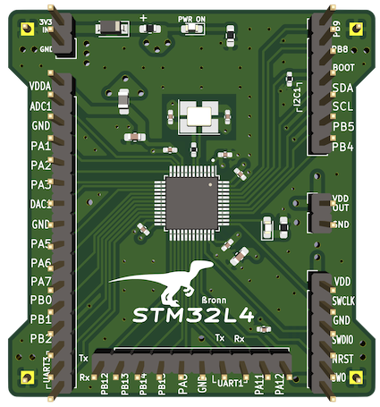

# RaptorXL4  

RaptorXL4 is a custom breakout board I designed to prototype the [Auto-Tuner](https://github.com/b-ashford/Auto-Tuner).  
It’s built around the **STM32L431CBT6** and includes:  

- 24 MHz HSE crystal  
- On-board ST-LINK–compatible programmer/debugger  
- User LED for quick “blinky” tests  
- VDDA supply with ferrite bead filtering for cleaner ADC performance  
- Access to most MCU pins for prototyping  
- Cool raptor silkscreen 

